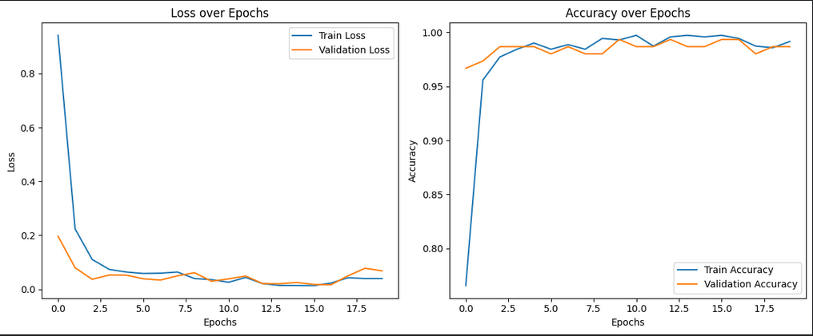
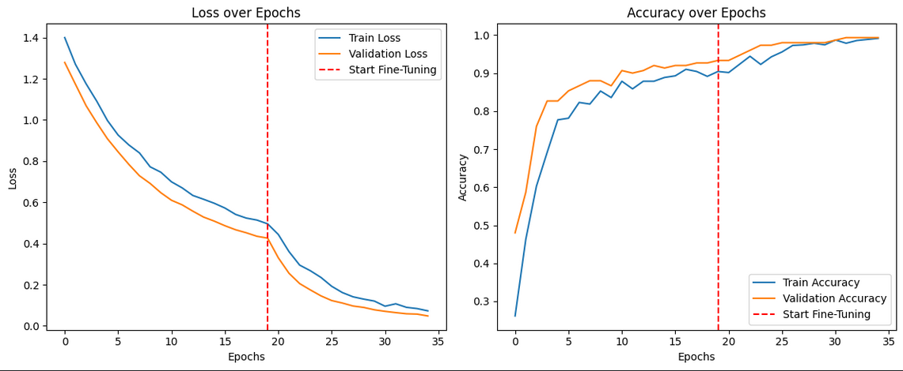
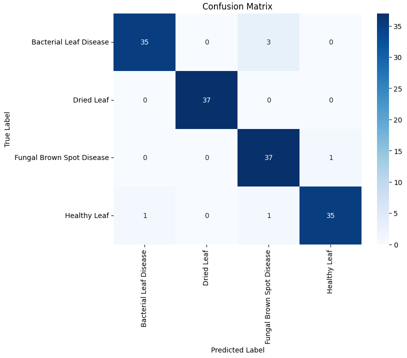

# CSE366/ICE476 Mini Project: Betel Leaf Disease Classification

This repository contains the implementation and results for the Mini Project Assignment for the Artificial Intelligence course. The project aims to explore, compare, and identify the most effective deep learning methodology for classifying plant leaf diseases from a given image dataset.

## Project Objective

The primary goal is to conduct a structured comparison of different Convolutional Neural Network (CNN) architectures, including pre-trained models, a custom-built CNN, and an attention-enhanced model. The final objective is to identify the best-performing and most generalizable model for the task.

## Dataset

The project utilizes a dataset of plant leaf images, categorized into four distinct classes:
1.  Bacterial Leaf Disease
2.  Dried Leaf
3.  Fungal Brown Spot Disease
4.  Healthy Leaf

The dataset is balanced, with approximately 37-38 samples per class in the test set.

## Repository Structure

```
.
├── code/
│   ├── efficientnetB0.ipynb
│   ├── inceptionv3.ipynb
│   ├── mobilenetv2.ipynb
│   ├── resnet50.ipynb
│   ├── densenet.ipynb
│   ├── xception.ipynb
│   └── alexnet.ipynb
    ├── vgg16.ipynb
└── README.md
```

---

## Task 2: Supervised Pre-trained Baselines

This task involved implementing and evaluating at least three pre-trained CNN architectures to establish baseline performance on the plant leaf disease dataset.

### Methodology

Several state-of-the-art pre-trained models were selected for evaluation. The core methodology involved transfer learning, where the convolutional base of each model was used as a feature extractor, and a new classifier head was trained for our specific task.

As per the assignment requirements, a full fine-tuning protocol (freezing initial layers and unfreezing/training later layers) was implemented and tested on the **DenseNet** and **Xception** models to explore potential performance gains. Due to time constraints, other models were evaluated using a feature extraction approach (training only the final classifier) to establish performance baselines quickly. All models were trained with consistent hyperparameters (optimizer, loss function) for a fair comparison.

### Results

The performance of each model was evaluated on the test set. The key metrics are summarized in the table below.

| Model Name      | Test Accuracy | F1-Score (Weighted) | Training Time (min) | Fine-Tuning Implemented? |
|-----------------|:-------------:|:-------------------:|:-------------------:|:------------------------:|
| **InceptionV3**     | **0.960**     | **0.96**            | **2.56**            | **No**                       |
| MobileNetV2     | 0.947         | 0.95                | 0.73                | No                       |
| ResNet50        | 0.947         | 0.95                | 11.84               | No                       |
| DenseNet 2.0    | 0.940         | 0.94                | 31.02               | **Yes**                  |
| EfficientNetB0  | 0.940         | 0.94                | 19.52               | No                       |
| AlexNet         | 0.920         | 0.92                | 0.47                | No                       |
| Xception        | 0.893         | 0.89                | 4.84                | **Yes**                  |
| vgg16           |0.907          | 0.91                | 2                   | Yes                      | 
---

### Analysis & Discussion

**Top Performer: InceptionV3**
The **InceptionV3** model achieved the highest test accuracy of **96.0%** and a weighted F1-score of 0.96. Remarkably, it achieved this state-of-the-art result in just **2.56 minutes** and *without* the extended fine-tuning process. This suggests that the feature representations learned by the base InceptionV3 model are highly effective and generalizable to this specific dataset.


*<p align="center">Figure 1: Training and validation curves for the top-performing InceptionV3 model.</p>*

**Fine-Tuning Impact: DenseNet**
The DenseNet model, which underwent a full fine-tuning protocol, also achieved a strong accuracy of 94.0%. The training curves clearly show the two-stage process, with loss decreasing further after fine-tuning began. While effective, it was significantly more computationally expensive (31.02 minutes).


*<p align="center">Figure 2: Training curves for DenseNet, showing the start of the fine-tuning phase.</p>*

<!-- 
    IMPORTANT: Generate the confusion matrix for InceptionV3 and save it as an image.
    Then, update the path below.
-->
**Model Evaluation: Confusion Matrix**
The confusion matrix for the best model, InceptionV3, demonstrates excellent performance across all classes with very few misclassifications.


*<p align="center">Figure 3: Confusion Matrix for the InceptionV3 model on the test set.</p>*

---

## Other Tasks (Status)

Due to project time constraints, the following tasks were not completed:

*   **Task 1: EDA and Related Work:** Not completed.
*   **Task 3: Custom CNN Model:** Not implemented.
*   **Task 4: Attention-Enhanced CNN Model:** Not implemented.
*   **Task 5: Explainability and Generalizability Testing:** Not implemented.

## Conclusion

Based on the extensive experiments in Task 2, **InceptionV3 is the most effective and efficient model for this plant disease classification task.** It delivered the highest accuracy with significantly lower training time compared to other high-performing models. For future work, applying the same fine-tuning protocol to InceptionV3 would be a logical next step and could potentially push the performance even higher.
